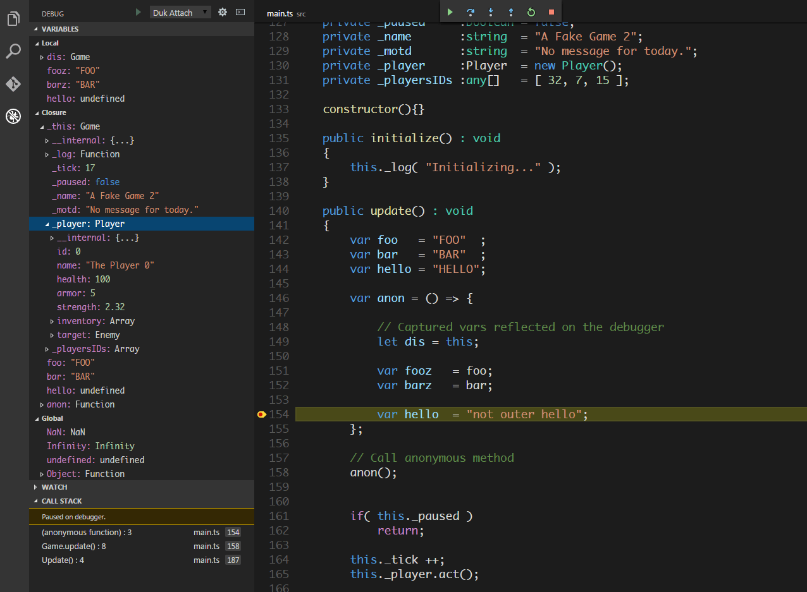

# VSCode Debugger for Duktape Runtimes

## Greetings
Greetings! And peace be with you in the name of our Lord Yeshua, the Messiah.

## Description
A debug adapter for Visual Studio Code written in Typescript targeting [Duktape](https://github.com/svaarala/duktape) runtimes. It implements the VS Code Debug Protocol (or CDP),

See: 
 - [https://code.visualstudio.com/docs/extensions/overview](https://code.visualstudio.com/docs/extensions/overview)
 - [https://code.visualstudio.com/docs/extensions/example-debuggers](https://code.visualstudio.com/docs/extensions/example-debuggers)

The adapter uses the protocol based on version 1.40 of [debugger.rst](https://github.com/svaarala/duktape/blob/master/doc/debugger.rst).
However, it is currently working off a branch which adds support for (heap object pointer inspection)[https://github.com/svaarala/duktape/tree/debugger-heap-walking-support], which I have
further used as a base to add another custom command to support inspecting closure variables.

Although I plan on releasing a simplified version that supports only the 1.50 features (when heap pointer inspection goes to the main branch), for now it can be used as a reference or a base to create your own debugger.

The client-side features include:
 - Deep object inspection (nested objects).
 - "this" object binding inspection.
 - Closure and globals inspection. (custom command on the runtime).
 - Console input evals.
 - Artificial property display.
 - Source map support. \**inlined currently unsupported*\*
 
 
*It does not currently support inspection of Proxy objects.*
 

## Status
In full working condition, but still in the process of being refactored and finalized. Options are not currently honored, and only attach mode is allowed.

## Acknoledgements
Special thanks to Sami Vaarala for developing Duktape, a wonderful library, and sharing it freely with the community.
Thanks also to the VSCode team for making a nice, and free, open source IDE and for making it easy to create extensions for it.

This code contains portions borrowed or adapted from the [vscode nodeJS debugger](https://github.com/Microsoft/vscode-node-debug) and Sami Vaarala's web-based nodeJS [reference implementation](https://github.com/svaarala/duktape/tree/master/debugger) of a Dukatape debug client.

## License
[MIT](https://github.com/harold-b/vscode-duktape-debug/blob/master/LICENSE)